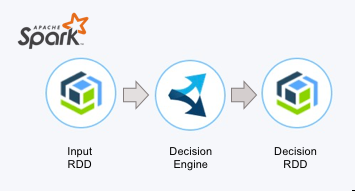

# decisions-on-spark
The integration code and datasets to execute at scale business rules in Apache Spark. 

IBM ODM empowers you to plug a rule engine in a map reduce Apache Spark application. While you keep all features coming from IBM ODM you get high scalability through Apache Spark with cluster deployment, and rule engines running in parallel in multiple JVMs and threads.

- [simple-loan-validation-spark-runner](simple-loan-validation-spark-runner/README.md): Shows how to automatically approve or reject loan applications by applying a business rules reasoning in a Spark map reduce approach.

- [metered-loan-validation-spark-runner](metered-loan-validation-spark-runner/README.md): Adding decision metering on the top of the simple project
