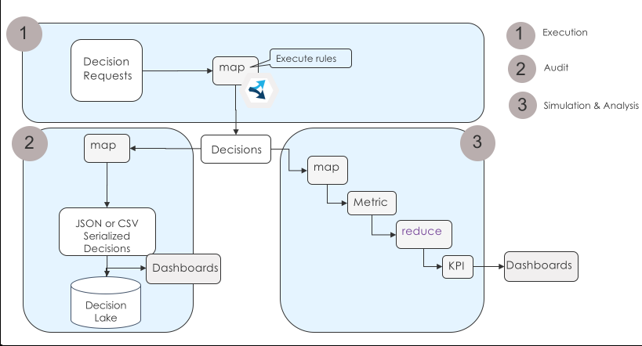

# A Business Automation Insights enabled loan processing on Apache Spark
This folder contains the source code to execute the ODM loan validation sample in an Apache Spark cluster.



This sample demonstrates the emission of decisions automated with IBM ODM, a capability of IBM Cloud Pak for Automation, into the BAI capability.
IBM BUsiness Automation Insights is a business intellignece tool that captures automation events through Kafka, and delivers ootb a pipeline to monitor them in dashboards, and write them into a data lake.

To perfom so we extend the simple loan validation on Spark sample with the following modifications:
1 - the ODM eXecution Unit registers a BAI plugin to activate the emission,
    BAI Kafka information are now read from an additional properties file, used at the plugin registration time
2 - the RuleApp archive is augmented with ruleset properties to ask for BAI emission for input, trace and output parameters.

## Pre requisites

### ODM & BAI libs
You need an IBM ODM 8.10.5 installation with ifixes to build the application. Root of your ODM installation is referred as <INSTALLDIR> in the instructions below. Maven files will look for the ODM and BAI emission jars under <INSTALLDIR>/executionserver/lib directory.
  
### BAI Kafka
Provision a BAI instance and retreive the Kafka information to feed the XU plugin.
All BAI Kafka properties are captured in the file src/mainresources/plugin-configuration.properties


## Get the code
Clone this repository.
```console
git clone
```
Open an terminal where your have cloned this repository.
```console
cd decisions-on-spark/bai-loan-validation-spark-runner
```
## Build
```console
mvn clean install -Dodm.install=<INSTALLDIR>
```
INSTALLDIR is the ODM 8.10.5 or upper version installation directory.

## Run locally


Automate loan validation on a CSV applications dataset to produce a CSV decision set.
```console
java -cp target/bailoanvalidationsparkrunner-1.0-SNAPSHOT-withspark.jar com.ibm.decisions.spark.loanvalidation.LoanValidationSparkRunner --input ../data/loanvalidation/1K/loanvalidation-requests-1K.csv --output ../data/loanvalidation/1K/loanvalidation-decisions-1K.csv --master local[8]
```

Automate loan validation on a JSON applications dataset to produce a JSON decision set.
```console
java -cp target/bailoanvalidationsparkrunner-1.0-SNAPSHOT-withspark.jar com.ibm.decisions.spark.loanvalidation.LoanValidationSparkRunner --input ../data/loanvalidation/1K/loanvalidation-requests-1K.json --output ../data/loanvalidation/1K/loanvalidation-decisions-1K.json --master local[8]
```

Automate loan validation on a JSON applications dataset to produce a JSON decision set and to display a Rule coverage.
```console
java -cp target/bailoanvalidationsparkrunner-1.0-SNAPSHOT-withspark.jar com.ibm.decisions.spark.loanvalidation.LoanValidationSparkRunner --input ../data/loanvalidation/1K/loanvalidation-requests-1K.json --output ../data/loanvalidation/1K/loanvalidation-decisions-1K.json --master local[8] --rulecoverage
```

Automate loan validation on 10 generated requests to produce a JSON decision set and to display a Rule coverage.
```console
java -cp target/bailoanvalidationsparkrunner-1.0-SNAPSHOT-withspark.jar com.ibm.decisions.spark.loanvalidation.LoanValidationSparkRunner --inputgen 10 --output ../data/loanvalidation/10/loanvalidation-decisions-10.json --master local[8] --rulecoverage
```

## Run in a Spark cluster
Rule based automation works in a cluster with the same integration pattern and code than in standalone.
Only differences of the application are about:
- the access to the datasets, as the Spark driver and executors run on different machines and local file systems. In consequence data have to be stored in hdfs or other shared persistence.
- the packaging, as Spark jars are not needed in the uber jar but already deployed in the cluster.

The target/simpleloanvalidationsparkrunner-1.0-SNAPSHOT-withodmrt.jar contains required classes to submit a Spark job.

The LoanValidationSparkRunner application can read or generate in memory the requests, then applies the loan validation decision logic, and computes metrics and finally KPIs.

When opening the stdout file you can check the loan approval traces and obtain the KPIs.

```console
...
Loan approved=false with a yearly repayment=0.0 insurance required:false messages= [The borrower's age is not valid.,  The loan amount is under the maximum authorized] executed in thread Executor task launch worker for task 8
Loan approved=true with a yearly repayment=1464.7636429039499 insurance required:true messages= [ The loan amount is under the maximum authorized, Low risk loan, Congratulations! Your loan has been approved] executed in thread Executor task launch worker for task 8

Decision batch metrics
Number of loan applications processed: 1000 in 2995 ms
Number of decision per sec: 333.0
Number of approved loan applications: 291 on a 1000 total
Number of loans approved with a YearlyInterestRate > 5%: 291
```
