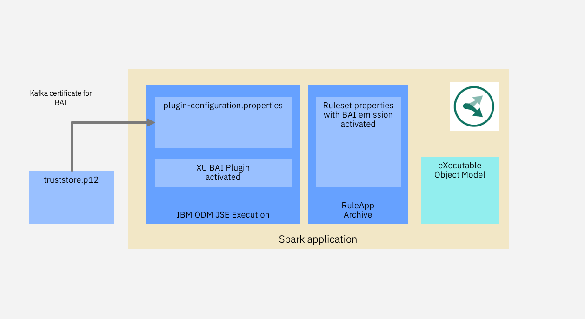

# A Business Automation Insights enabled loan processing on Apache Spark
This sample derives from the simple loan validation by adding an emission of decision events through the Business Automation Insights capability.
The motivation is to automate at scale your decisions in Spark while sending through Kafka all decision traces for an ootb monitoring based on ELK, Flink and Kibana.

This folder contains the source code to execute the ODM loan validation sample in an Apache Spark cluster with BAI emission.



This sample demonstrates the emission of decisions automated with IBM ODM, a capability of IBM Cloud Pak for Automation, into the BAI capability.
IBM Business Automation Insights is a business intellignece tool that captures automation events through Kafka, and delivers ootb a pipeline to monitor them in dashboards. You can write them into a data lake.

To perfom so we extend the simple loan validation on Spark sample with the following modifications:
   * the ODM eXecution Unit registers a BAI eXecution Unit plugin to activate the emission. The sample code reads the BAI Kafka information from an additional properties file, used at the plugin registration time, to pass it to the Kafka client integrated in the rule execution.
   * the RuleApp archive is augmented with ruleset properties to ask for BAI emission for input, trace and output parameters.

## Pre requisites

### ODM & BAI libs
You need an IBM ODM 8.10.5 installation with IF003 ifix to build the application. Root of your ODM installation is referred as <INSTALLDIR> in the instructions below. Maven files will look for the ODM and BAI emission jars under <INSTALLDIR>/executionserver/lib directory.
  
### BAI Kafka
Provision a BAI instance and retreive the Kafka information to feed the XU plugin.
All BAI Kafka properties will be captured in the file src/mainresources/plugin-configuration.properties


## Get the code
Clone this repository.
```console
git clone
```
Open an terminal where your have cloned this repository.
```console
cd decisions-on-spark/bai-loan-validation-spark-runner
```

## Tune the BAI emission for a decision service
You can modulate the BAI emission properties in the RuleApp archive to activate the selction of the input, output and trace information to be sent to Kafka.
For input & output parameters only you change the descriptor for the ruleset in the ruleapp archive as follows:
```console
cp META-INF/archive-bai-in-out.xml META-INF/archive.xml
jar uf ../ruleapps/loanvalidation.jar META-INF/archive.xml 
```

## Build
```console
mvn clean install -Dodm.install=<INSTALLDIR>
```
INSTALLDIR is the ODM 8.10.5 or upper version installation directory.

## Run locally


Automate loan validation on a CSV applications dataset to produce a CSV decision set.
```console
java -cp target/bailoanvalidationsparkrunner-1.0-SNAPSHOT-withspark.jar com.ibm.decisions.spark.loanvalidation.LoanValidationSparkRunner --input ../data/loanvalidation/1K/loanvalidation-requests-1K.csv --output ../data/loanvalidation/1K/loanvalidation-decisions-1K.csv --master local[8]
```

Automate loan validation on a JSON applications dataset to produce a JSON decision set.
```console
java -cp target/bailoanvalidationsparkrunner-1.0-SNAPSHOT-withspark.jar com.ibm.decisions.spark.loanvalidation.LoanValidationSparkRunner --input ../data/loanvalidation/1K/loanvalidation-requests-1K.json --output ../data/loanvalidation/1K/loanvalidation-decisions-1K.json --master local[8]
```

Automate loan validation on a JSON applications dataset to produce a JSON decision set and to display a Rule coverage.
```console
java -cp target/bailoanvalidationsparkrunner-1.0-SNAPSHOT-withspark.jar com.ibm.decisions.spark.loanvalidation.LoanValidationSparkRunner --input ../data/loanvalidation/1K/loanvalidation-requests-1K.json --output ../data/loanvalidation/1K/loanvalidation-decisions-1K.json --master local[8] --rulecoverage
```

Automate loan validation on 10 generated requests to produce a JSON decision set and to display a Rule coverage.
```console
java -cp target/bailoanvalidationsparkrunner-1.0-SNAPSHOT-withspark.jar com.ibm.decisions.spark.loanvalidation.LoanValidationSparkRunner --inputgen 10 --output ../data/loanvalidation/10/loanvalidation-decisions-10.json --master local[8] --rulecoverage
```

## Run in a Spark cluster
Rule based automation works in a cluster with the same integration pattern and code than in standalone.
Please refer to the cluster section of 

## Visualize your automated decisions in a BAI dashboard
The decision event emitted from the Spark application flow through a Kafka/Flink/ELK pipeline. From a BAI installation you see the decisions in Business Performance Center as captured below. In addition to the general Decisions dashboard you can make your own more tailored to vertical needs.


