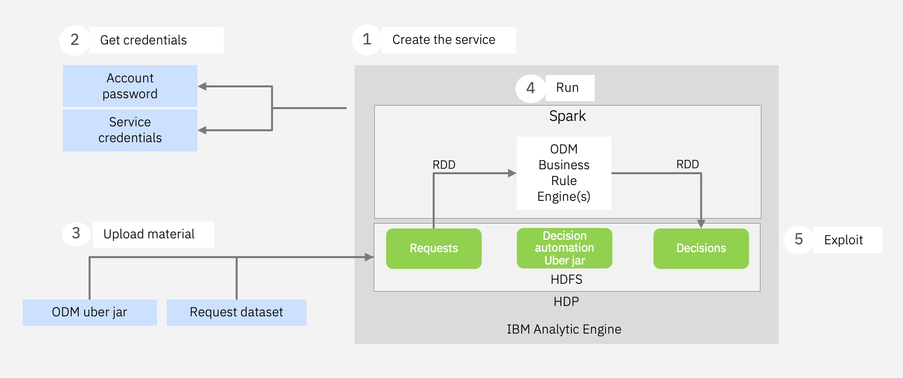

## Automate decisions in Hortonworks Data Platform with IBM Analytic Engine



### Setup an IBM Analytic Engine service instance in IBM Cloud

Login in the IBM public cloud and provision an Analytic Engine service instance at https://cloud.ibm.com/catalog/services/analytics-engine.
After few minutes your Hadoop environment is hosted.

When choosing the free plan your instance makes available an AE 1.2 Spark and Hive configuration in Q1 2021 with the following components:
* Apache Spark 2.3.2
* Hadoop 3.1.1
* Apache Livy 0.5
* Knox 1.0.0
* Ambari 2.7.5
* Miniconda-Py 3.7.9
* Hive 3.1.0
* Jupyter Enterprise Gateway 0.8.0

The environment shows 4 nodes including 1 for management, 2 workers and 1 for data.
Each worker brings an Java/Scala executor running on 1 core.

#### Generate the password for the clsadmin user
First step consists in generating the password. If action fails just take a coffe break, it will works few minutes later on.

#### Generate the credentials
In the left side of the service UI generate the credentials meaning all the endpoints for ssh, cli and livy.

You are now ready to run a Spark batch application in your environment.
IAE empowers to submit a batch through several ways:
* ssh
* cli
* livy

We explain the steps and commands for ssh. While the cli and livy differ by their protocol and gateway the core Spark processing remains unchanged.

### Create a ssh session with the Hadoop environment
You log in with ssh as described at https://cloud.ibm.com/docs/AnalyticsEngine?topic=AnalyticsEngine-ssh-connection

```console
ssh clsadmin@<ssh-machine> with <ssh-machine> as described in the credentials 
by example
ssh clsadmin@chs-abc-170-mn001.us-south.ae.appdomain.cloud
```
Enter the clsadmin password and enter in the ssh session.

create an odm directory and data subdirectory for convenience.
```console
mkdir odm
cd odm
mkdir data
cd ..
```

#### Copy the ODM uber jar and a loan application request dataset on the Hadoop local file system
In anoter terminal of your work station you upload the uber jar from your workstation to the hadoop machine with an scp command.
Choose the 'withodmrt' jar to run in IAE as the Spark jars are provided.
```console
scp target/simpleloanvalidationsparkrunner-1.0-SNAPSHOT-withodmrt.jar clsadmin@chs-qxd-170-mn001.us-south.ae.appdomain.cloud:/home/wce/clsadmin/odm
by example ssh clsadmin@chs-axf-170-mn001.us-south.ae.appdomain.cloud
```
```console
 scp ../data/loanvalidation/1K/loanvalidation-requests-1K.csv clsadmin@chs-axg-170-mn001.us-south.ae.appdomain.cloud:/home/wce/clsadmin/odm/data//loanvalidation-requests-1K.csv
```

### Submit the rule based decision making in IBM Analytic Engine through ssh
Start a spark-submit command to launch the batch.

```console
...
spark-submit \
--name “loan-validation” \
--class com.ibm.decisions.spark.loanvalidation.LoanValidationSparkRunner \
/home/wce/clsadmin/simpleloanvalidationsparkrunner-1.0-SNAPSHOT-withodmrt.jar \
--input hdfs://machine2.bi.services.us-south.bluemix.net:8020/user/clsadmin/data/loanvalidation/loanvalidation-requests-1K.csv  \
--output hdfs://machine2.bi.services.us-south.bluemix.net:8020/user/clsadmin/data/loanvalidation/loanvalidation-decisions-1K.csv
```
In ssh you see a result like this.

You can read the output decision file written on hdfs by navigation in the Ambari UI.

```console
...
spark-submit \
--name “loan-validation” \
--class com.ibm.decisions.spark.loanvalidation.LoanValidationSparkRunner \
/home/wce/clsadmin/simpleloanvalidationsparkrunner-1.0-SNAPSHOT-withodmrt.jar \
--input hdfs://machine2.bi.services.us-south.bluemix.net:8020/user/clsadmin/data/loanvalidation/loanvalidation-requests-1K.csv  \
--output hdfs://machine2.bi.services.us-south.bluemix.net:8020/user/clsadmin/data/loanvalidation/loanvalidation-decisions-1K.csv
```
Result of the submit is like follows.
```console
...
Executing from: /home/wce/clsadmin/.
Loading dataset file: hdfs://machine2.us-south.bluemix.net:8020/user/clsadmin/data/loanvalidation/loanvalidation-requests-1K.csv
...
18/04/30 15:01:57 INFO Executor: Adding file:/tmp/spark-361d546f-d868-443e-81de-2390f58c5492/userFiles-1a30c-fb2d-4d6a-a3fb-1a9acf063e/simpleloanvalidationsparkrunner-1.0-SNAPSHOT-withodmrt.jar to class loader
...
Starting decision automation...
Dataset generation: false
...
18/04/30 15:01:57 INFO execution: Found user settings in file : ra.xml.
18/04/30 15:01:57 INFO execution: Loading execution unit (XU) settings from the file descriptor.
18/04/30 15:01:57 INFO execution: Found user settings in file : ra.xml.
18/04/30 15:01:57 INFO execution: Loading execution unit (XU) settings from the file descriptor.
18/04/30 15:01:58 WARN persistence: XOM repository set in file persistence mode: /home/wce/clsadmin/repo/res_xom
18/04/30 15:01:58 WARN persistence: XOM repository set in file persistence mode: /home/wce/clsadmin/repo/res_xom
18/04/30 15:01:58 WARN persistence: RESMGMT persistence: Adding RuleApp "/loanvalidation/1.0".
18/04/30 15:01:58 WARN persistence: RESMGMT persistence: Adding RuleApp "/loanvalidation/1.0".
18/04/30 15:01:58 WARN persistence: RESMGMT persistence: RuleApp "/loanvalidation/1.0" is added.
18/04/30 15:01:58 WARN persistence: RESMGMT persistence: RuleApp "/loanvalidation/1.0" is added.
...
Loan approved=false with a yearly repayment=20963.776805681675 insurance required:false messages= [ The loan amount is under the maximum authorized, Risky loan, Too big Debt/Income ratio: 1.67, We are sorry. Your loan has not been approved] executed in thread Executor task launch worker for task 7
Loan approved=false with a yearly repayment=6674.226300783769 insurance required:false messages= [ The loan amount is under the maximum authorized, Average risk loan, Too big Debt/Income ratio: 0.85, We are sorry. Your loan has not been approved] executed in thread Executor task launch worker for task 7
...
Automation ended with 1000 decisions
Decision batch metrics
Number of loan applications processed: 1000 in 7484 ms
Number of decision per sec: 133.0
Number of approved loan applications: 45 on a 1000 total
Number of loans approved with a YearlyInterestRate > 5%: 45
```
