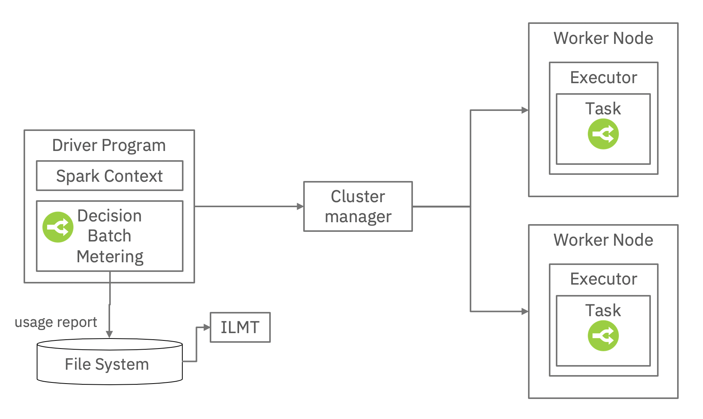

# Metering decisions automated with IBM DBA in an Apache Spark grid

IBM DBA empowers to track a decision automation performed in an Apache Spark cluster. 
The approachs is straightforward and leverages ILMT installed on a single machine.



When running an application that runs one or several rule based decision services in your Spark cluster you basically capture the number of decisions. You typically apply a count on your RDD or dataset of automated decisions.

You then use the DecisionMetering & DecisionMeteringReport helper classes as integared in the sample code to track the number of decisions made and write it by default on the driver local file system. Each decision set usage is written into an ILMT slmtag file.
The solution requires to have an ILMT agent scanning the file system where you write the slmtag file to report the usage for IBM compliance.

You can change the file system for the writing, or automate a copy of the slmtag file to another file system outside of the big data IT. In all cases the smltag file has to be scanned by an ILMT agent.

### Usage metering
The helper code is provided in the simple app project. It includes a DecisionMeteringService class responsible for metering the decision automation usage made in the grid.
Typical invocation is as follows:
```console

DecisionMetering decisionMetering = null;
DecisionMeteringReport report = null;

decisionMetering = new DecisionMetering("dba-metering");
String batchId = sc.getConf().getAppId() + "-" + System.currentTimeMillis();
report = decisionMetering.createUsageReport(batchId);
		
// Produce a RDD of decisions
JavaRDD<LoanValidationDecision> decisions = requestRDD.map(executeDecisionService).cache();

long stopTime = System.currentTimeMillis();

//Usage metering
report.setNbDecisions(decisions.count());
report.setStopTimeStamp();
report.writeILMTFile();
```
The writeILMTFile method writes the usage report on the local file system of the Spark driver under a var/ibm/slmtags relative path. 

Sequenced executed Spark batches reuses the same smltag file and extend the list of report items. Here is an example of slmtag file generated:

```console
<SchemaVersion>2.1.1</SchemaVersion>
<SoftwareIdentity>
	<PersistentId>b1a07d4dc0364452aa6206bb6584061d</PersistentId>
	<Name>IBM Operational Decision Manager Server</Name>
	<InstanceId>/usr/IBM/TAMIT</InstanceId>
</SoftwareIdentity>
<Metric logTime="2019-07-18T16:39:34+02:00">
	<Type>MILLION_MONTHLY_DECISIONS</Type>
	<SubType></SubType>
	<Value>1.235</Value>
	<Period>
		<StartTime>2019-07-18T16:39:34+02:00</StartTime>
		<EndTime>2019-07-18T16:39:34+02:00</EndTime>
	</Period>
</Metric>
```
This slmtag file directory has to be scanned by the IBM ILMT tool to consolidate and report the product usages.

To check the decision automation usages go the IBM ILMT console, go to Reports -> Resource Utilization to see the "IBM Operational Decision Manager" usages.
