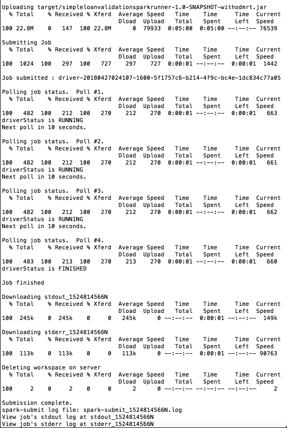

# Simple loan validation on Apache Spark
This folder contains the source code to execute the ODM loan validation sample in an Apache Spark cluster.


## Pre requisites
You need an IBM ODM 892 installation to build the application. Root of your ODM installation is referred as <INSTALLDIR> in the instructions below. Maven files will look for the ODM jars under <INSTALLDIR>/executionserver/libs directory.

## Get the code
Clone this repository.
```console
git clone
```
Open an terminal where your have cloned this repository.
```console
cd decisions-on-spark/simple-loan-validation-spark-runner
```
## Build
```console
mvn clean install -Dodm.install=<INSTALLDIR>
```
<INSTALLDIR> is the ODM 892 installation directory.

## Run locally


Automate loan validation on a CSV applications dataset to produce a CSV decision set.
```console
java -cp target/simpleloanvalidationsparkrunner-1.0-SNAPSHOT-withspark.jar com.ibm.decisions.spark.loanvalidation.LoanValidationSparkRunner --input ../data/loanvalidation/1K/loanvalidation-requests-1K.csv --output ../data/loanvalidation/1K/loanvalidation-decisions-1K.csv --master local[8]
```

Automate loan validation on a JSON applications dataset to produce a JSON decision set.
```console
java -cp target/simpleloanvalidationsparkrunner-1.0-SNAPSHOT-withspark.jar com.ibm.decisions.spark.loanvalidation.LoanValidationSparkRunner --input ../data/loanvalidation/1K/loanvalidation-requests-1K.json --output ../data/loanvalidation/1K/loanvalidation-decisions-1K.json --master local[8]
```

Automate loan validation on a JSON applications dataset to produce a JSON decision set and to display a Rule coverage.
```console
java -cp target/simpleloanvalidationsparkrunner-1.0-SNAPSHOT-withspark.jar com.ibm.decisions.spark.loanvalidation.LoanValidationSparkRunner --input ../data/loanvalidation/1K/loanvalidation-requests-1K.json --output ../data/loanvalidation/1K/loanvalidation-decisions-1K.json --master local[8] --rulecoverage
```

Automate loan validation on a JSON applications dataset to produce a JSON decision set and to meter the decision execution usage.
```console
java -cp target/simpleloanvalidationsparkrunner-1.0-SNAPSHOT-withspark.jar com.ibm.decisions.spark.loanvalidation.LoanValidationSparkRunner --input ../data/loanvalidation/1K/loanvalidation-requests-1K.json --output ../data/loanvalidation/1K/loanvalidation-decisions-1K.json --master local[8] --metering
```
## Run in a cluster
Rule based automation works in a cluster with the same integration pattern and code than in standalone.
Only differences of the application are about:
- the access to the datasets, as the Spark driver and executors run on different machines and local file systems. In consequence data have to be stored in hdfs or other shared persistence.
- the packaging, as Spark jars are not needed in the uber jar but already deployed in the cluster.

The target/simpleloanvalidationsparkrunner-1.0-SNAPSHOT-withodmrt.jar contains required classes to submit a Spark job.

The LoanValidationSparkRunner application can read or generate in memory the requests, then applies the loan validation decision logic, and computes metrics and finally KPIs.

### Running in IBM Spark service
Below is the submit command as tested with the IBM Cloud Spark service with a random generation of the requests.
```console
./spark-submit.sh \
--vcap ./vcap-odm123.json \
--name “loan-validation”  \
--deploy-mode cluster \
--conf spark.service.spark_version=2.1 \
--class com.ibm.decisions.spark.loanvalidation.LoanValidationSparkRunner \
target/simpleloanvalidationsparkrunner-1.0-SNAPSHOT-withodmrt.jar \
--inputgen 1000  \
--output loanvalidation-decisions-1K.json
```
By submitting the application you get a trace similar to this one.



When opening the stdout file you can check the loan approval traces and obtain the KPIs.

```console
...
Loan approved=false with a yearly repayment=0.0 insurance required:false messages= [The borrower's age is not valid.,  The loan amount is under the maximum authorized] executed in thread Executor task launch worker for task 8
Loan approved=true with a yearly repayment=1464.7636429039499 insurance required:true messages= [ The loan amount is under the maximum authorized, Low risk loan, Congratulations! Your loan has been approved] executed in thread Executor task launch worker for task 8

Decision batch metrics
Number of loan applications processed: 1000 in 2995 ms
Number of decision per sec: 333.0
Number of approved loan applications: 291 on a 1000 total
Number of loans approved with a YearlyInterestRate > 5%: 291
```
### Running Business Rules on IBM Analytic Engine
Below is the submit command as tested with the public IBM Analylic Engine with a read of a request dataset file.

```console
...
spark-submit \
--name “loan-validation” \
--conf spark.service.spark_version=2.1 \
--class com.ibm.decisions.spark.loanvalidation.LoanValidationSparkRunner \
/home/wce/clsadmin/simpleloanvalidationsparkrunner-1.0-SNAPSHOT-withodmrt.jar \
--input hdfs://machine2.bi.services.us-south.bluemix.net:8020/user/clsadmin/data/loanvalidation/loanvalidation-requests-1K.csv  \
--output hdfs://machine2.bi.services.us-south.bluemix.net:8020/user/clsadmin/data/loanvalidation/loanvalidation-decisions-1K.csv
```
Result of the submit is like follows.
```console
...
Executing from: /home/wce/clsadmin/.
Loading dataset file: hdfs://machine2.us-south.bluemix.net:8020/user/clsadmin/data/loanvalidation/loanvalidation-requests-1K.csv
...
18/04/30 15:01:57 INFO Executor: Adding file:/tmp/spark-361d546f-d868-443e-81de-2390f58c5492/userFiles-1a30c-fb2d-4d6a-a3fb-1a9acf063e/simpleloanvalidationsparkrunner-1.0-SNAPSHOT-withodmrt.jar to class loader
...
Starting decision automation...
Dataset generation: false
...
18/04/30 15:01:57 INFO execution: Found user settings in file : ra.xml.
18/04/30 15:01:57 INFO execution: Loading execution unit (XU) settings from the file descriptor.
18/04/30 15:01:57 INFO execution: Found user settings in file : ra.xml.
18/04/30 15:01:57 INFO execution: Loading execution unit (XU) settings from the file descriptor.
18/04/30 15:01:58 WARN persistence: XOM repository set in file persistence mode: /home/wce/clsadmin/repo/res_xom
18/04/30 15:01:58 WARN persistence: XOM repository set in file persistence mode: /home/wce/clsadmin/repo/res_xom
18/04/30 15:01:58 WARN persistence: RESMGMT persistence: Adding RuleApp "/loanvalidation/1.0".
18/04/30 15:01:58 WARN persistence: RESMGMT persistence: Adding RuleApp "/loanvalidation/1.0".
18/04/30 15:01:58 WARN persistence: RESMGMT persistence: RuleApp "/loanvalidation/1.0" is added.
18/04/30 15:01:58 WARN persistence: RESMGMT persistence: RuleApp "/loanvalidation/1.0" is added.
...
Loan approved=false with a yearly repayment=20963.776805681675 insurance required:false messages= [ The loan amount is under the maximum authorized, Risky loan, Too big Debt/Income ratio: 1.67, We are sorry. Your loan has not been approved] executed in thread Executor task launch worker for task 7
Loan approved=false with a yearly repayment=6674.226300783769 insurance required:false messages= [ The loan amount is under the maximum authorized, Average risk loan, Too big Debt/Income ratio: 0.85, We are sorry. Your loan has not been approved] executed in thread Executor task launch worker for task 7
...
Automation ended with 1000 decisions
Decision batch metrics
Number of loan applications processed: 1000 in 7484 ms
Number of decision per sec: 133.0
Number of approved loan applications: 45 on a 1000 total
Number of loans approved with a YearlyInterestRate > 5%: 45
```

### Usage metering
The code includes a DecisionMeteringService class responsible for metering the decision automation usage made in the grid.
Approach is straitforward as showedd in the sample. Typical invocation is as follows:
```console

DecisionMetering decisionMetering = null;
DecisionMeteringReport report = null;

decisionMetering = new DecisionMetering("dba-metering");
String batchId = sc.getConf().getAppId() + "-" +System.currentTimeMillis();
report = decisionMetering.createUsageReport(batchId);
		
// Produce a RDD of decisions
JavaRDD<LoanValidationDecision> decisions = requestRDD.map(executeDecisionService).cache();

long stopTime = System.currentTimeMillis();

//Usage metering
report.setNbDecisions(decisions.count());
report.setStopTimeStamp();
report.writeILMTFile();
```
The writeILMTFile method writes the usage report on the local file system of the Spark driver under a var/ibm/slmtags relative path. 

Sequenced executed Spark batches reuses the same smltag file and extend the list of report items. Here is an example of slmtag file generated:

```console
<SchemaVersion>2.1.1</SchemaVersion>
<SoftwareIdentity>
	<PersistentId>b1a07d4dc0364452aa6206bb6584061d</PersistentId>
	<Name>IBM Operational Decision Manager Server</Name>
	<InstanceId>/usr/IBM/TAMIT</InstanceId>
</SoftwareIdentity>
<Metric logTime="2019-07-18T16:39:34+02:00">
	<Type>VU_VALUE_UNIT</Type>
	<SubType>MILLION_MONTHLY_DECISIONS</SubType>
	<Value>1.235</Value>
	<Period>
		<StartTime>2019-07-18T16:39:34+02:00</StartTime>
		<EndTime>2019-07-18T16:39:34+02:00</EndTime>
	</Period>
</Metric>
<Metric logTime="2019-07-19T14:32:21+02:00">
	<Type>VU_VALUE_UNIT</Type>
	<SubType>THOUSAND_MONTHLY_ARTIFACTS</SubType>
	<Value>23.456</Value>
	<Period>
		<StartTime>2019-07-19T14:30:04+02:00</StartTime>
		<EndTime>2019-07-19T14:32:21+02:00</EndTime>
	</Period>
</Metric>
```
This slmtag file directory has to be scanned by the IBM ILMT tool to consolidate and report the product usages.

In the ILMT console Go to Reports -> Resource Utilization to see the "IBM Operational Decision Manager" usages.
