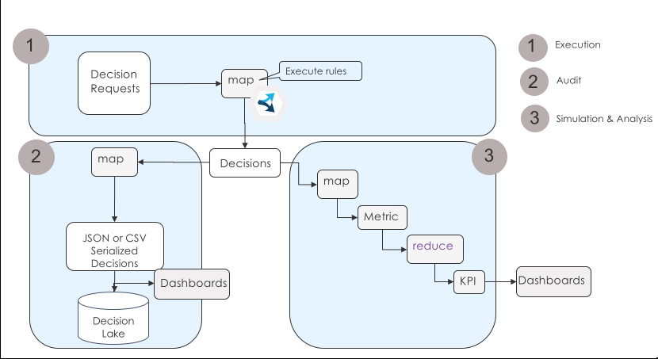

# Simple loan validation on Apache Spark
This folder contains the source code to execute the ODM loan validation sample in an Apache Spark cluster.



## Get the code
```console
git clone
```

## Build
```console
mvn clean install -Dodm.install=<INSTALLDIR>
```

## Run locally
Automate loan validation on a CSV applications dataset to produce a CSV decision set
```console
java -cp target/simpleloanvalidationsparkrunner-1.0-SNAPSHOT-withspark.jar com.ibm.decisions.spark.loanvalidation.SimpleLoanValidationSparkRunnerCSV 
```

Automate loan validation on a JSON applications dataset to produce a JSON decision set
```console
java -cp target/simpleloanvalidationsparkrunner-1.0-SNAPSHOT-withspark.jar com.ibm.decisions.spark.loanvalidation.SimpleLoanValidationSparkRunnerJSON 
```

Automate loan validation on a JSON applications dataset to produce a JSON decision set and to display a Rule coverage
```console
java -cp target/simpleloanvalidationsparkrunner-1.0-SNAPSHOT-withspark.jar com.ibm.decisions.spark.loanvalidation.SimpleLoanValidationSparkRunnerJSONWithCoverage
```
## Run on a cluster
Rule based automation works in a cluster with the same integration pattern and code.
Only differences of the application are about:
- the access to the datasets, as they are accessed by the driver and executors running on different machines and local file systems,
- the packaging, as Spark jars are not needed in the uber jar but already deployed in the cluster.

The target/simpleloanvalidationsparkrunner-1.0-SNAPSHOT-withodmrt.jar contains required classes to submit a Spark job.

Automate loan validation on a CSV applications dataset to produce a CSV decision set. Below id the submit command as tested with the IBM Cloud Spark service.
```console
./spark-submit.sh \
--vcap ./vcap-odm123.json \
--deploy-mode cluster \
--conf spark.service.spark_version=2.1 \
--class com.ibm.decisions.spark.loanvalidation.SimpleLoanValidationSparkRunnerCSV \
target/simpleloanvalidationsparkrunner-1.0-SNAPSHOT-withodmrt.jar
```

```console
mvn exec:java -Dodm.install=<INSTALLDIR>
```


